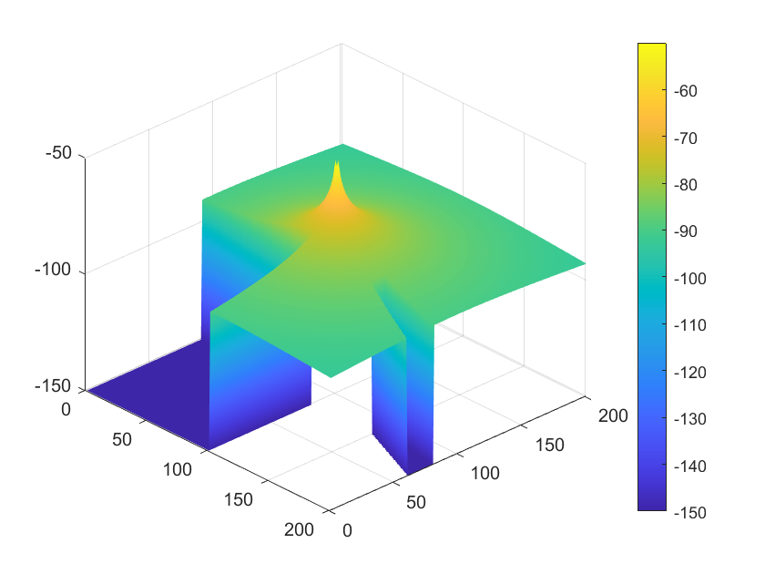
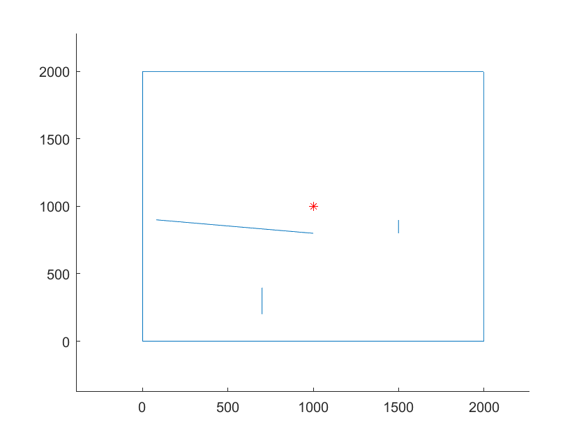
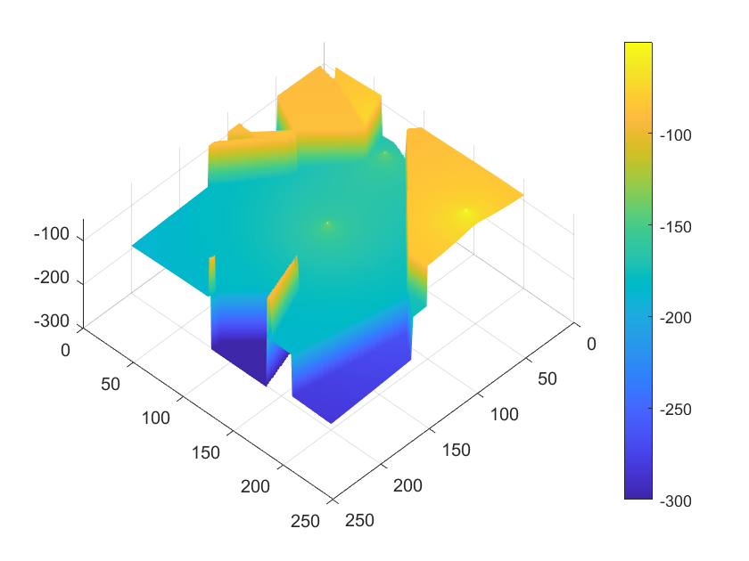
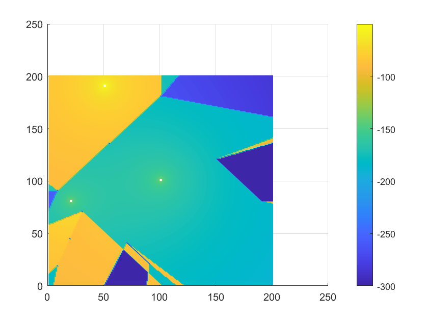

# Simple2DSignalPropagation

Modeling the propagation of radio waves inside the 2d prestige, assuming impenetrable walls and reflection of the signal from the wall surface until the reflected signal does not completely lose its value

We will use to carry out the experiment:

1. Free-space path loss pattern - which introduces radio energy attenuation between the receiver and transmitter in a free space, in a straight line. It also takes into account that the energy of the wave is distributed over a sphere with radius R, and the receiving antenna captures only a part of the energy in relation to the entire surface of the sphere.

#### Example output so far:

 - Single transmiter:
    
    

 - Three transmiters:
    
    
    

>
>   Bouncing the signal off the walls doesn't work yet
>

Recources:
- https://en.wikipedia.org/wiki/Free-space_path_loss
- https://en.wikipedia.org/wiki/Radio_propagation